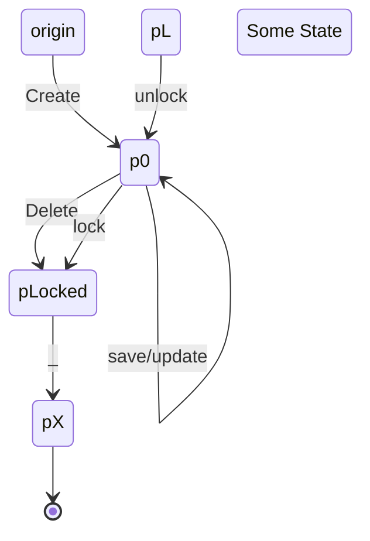
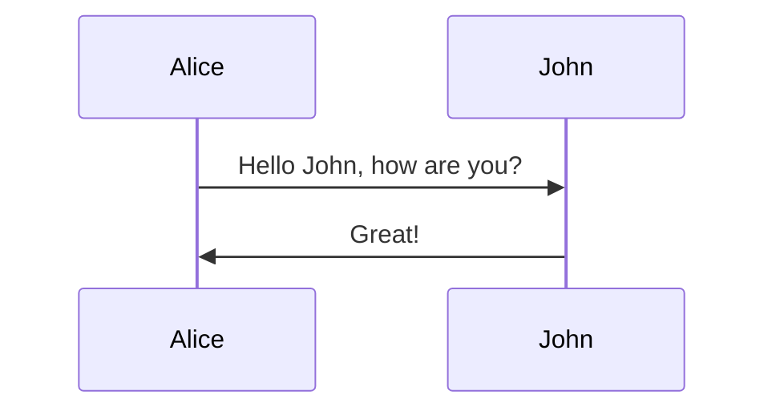

# Info about this repo
This repository contains a reference CDK deployment that deploys a lambda pattern, you can modify this CDK pattern in `lib/pdf_lambda-stack.ts`.

Additionally included are submodules that are example lambda functions that convert input into PDF output in a variety of methods.

When you clone the repository, please use the following command which will pull the submodules in parallel and ensure you have the code necessary for deployment.
`git clone --recurse-submodules -j8 https://github.com/evcatalyst/pdfLambda`

In the respective submodule you are chosing, you will need to enter the relevant directory and run `npm install` to ensure that the `node_modules` dependencies are available.

Once you modify the code, run the following from the root of the repository:

 * `npm run build`  which will compile the cdk typescript to js
 * `cdk deploy` which will deploy the stack to your default AWS account / region

Note that if you make a change to the underlying lambda code, and are in a testing/development mode, you should do a destroy/deploy since CDK does not track changes in underlying "assets" which the lambda code is, and the difference will not show up on a diff and will not generate a new zip file on deploy unless you have destroyed the existing CDK deployment. You can do that via `cdk destroy`

